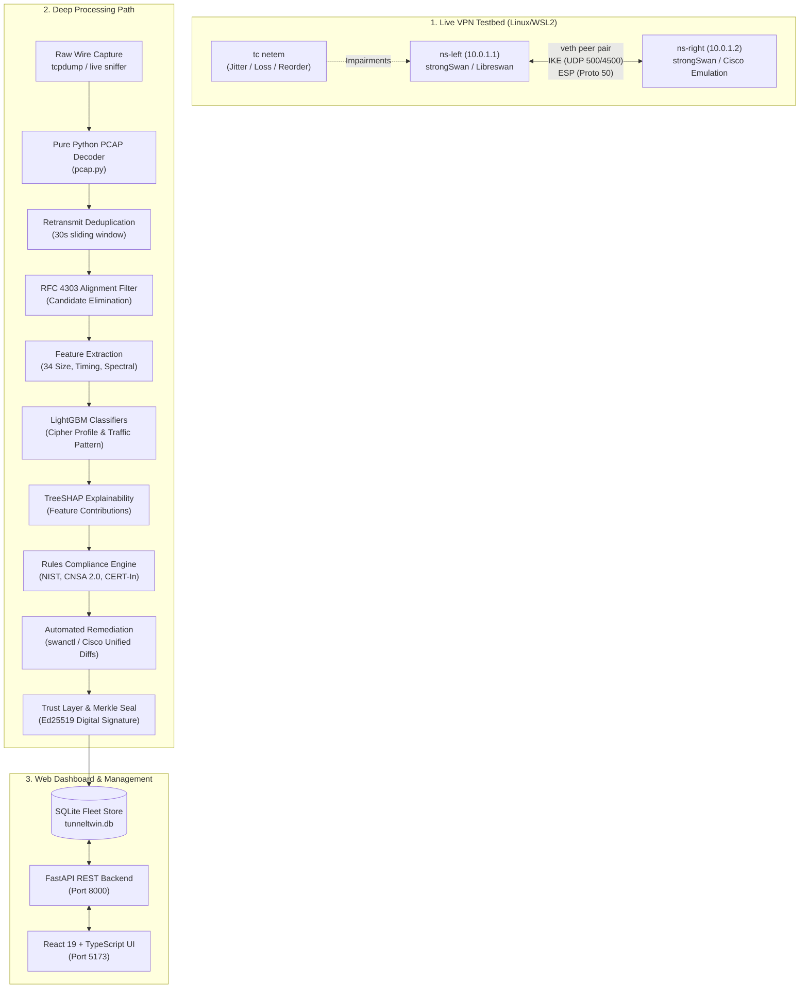

# TunnelTwin — Live Prototype Demo & VPN Testbed Operational Guide
**AI-Powered IPsec Protocol Analyzer & Cryptographic Assessment Framework**  
*Problem Statement 26160 (NTRO / SIH 2026)*

---

## Executive Summary & System Flow



---

## PART 1: Starting the Live VPN Testbed (Step-by-Step)

The VPN testbed runs inside isolated Linux network namespaces (`ns-left` and `ns-right`) connected by a virtual Ethernet cable (`veth-left` <-> `veth-right`). This requires root privileges on Linux or WSL2 (Ubuntu).

### Step 1.1: Create Network Namespaces & Virtual Ethernet Link
Run the namespace setup script:
```bash
sudo bash lab/setup_namespaces.sh
```
**What happens under the hood:**
1. Cleans up any existing namespaces (`ns-left`, `ns-right`).
2. Creates two isolated network namespaces:
   - `ns-left`: IP `10.0.1.1/30`
   - `ns-right`: IP `10.0.1.2/30`
3. Connects them with a virtual Ethernet pair (`veth-left` <-> `veth-right`).
4. Disables reverse-path filtering (`rp_filter=0`) and enables IP forwarding to allow encapsulated ESP routing.
5. Verifies end-to-end Layer 3 ICMP connectivity between `10.0.1.1` and `10.0.1.2`.

---

### Step 1.2: Launch Isolated IPsec Daemons (strongSwan / Libreswan)
Spawn independent daemon instances in each namespace without colliding on standard `/var/run` sockets:
```bash
# Start strongSwan charon daemon in left namespace
sudo bash lab/start_charon.sh ns-left

# Start strongSwan charon daemon in right namespace
sudo bash lab/start_charon.sh ns-right
```
**What happens under the hood:**
- Generates a custom namespace-scoped configuration in `/tmp/tunneltwin/ns-left/strongswan.conf`.
- Binds an independent Unix VICI control socket at `/tmp/tunneltwin/ns-left/charon.vici`.
- Mounts a private tmpfs for process IDs to prevent process collisions between peers.

---

### Step 1.3: Establish the IPsec VPN Tunnel
Load one of the 4 cryptographic profile configurations and negotiate the Security Associations (IKE SA and Child ESP SA):

```bash
# Example: Establish the 'strong' profile (AES-256-GCM / ECP-384)
sudo swanctl --load-all --file lab/configs/strong/right.conf --uri unix:///tmp/tunneltwin/ns-right/charon.vici
sudo swanctl --load-all --file lab/configs/strong/left.conf --uri unix:///tmp/tunneltwin/ns-left/charon.vici

# Initiate the tunnel from ns-left
sudo swanctl --initiate --child strong-child --uri unix:///tmp/tunneltwin/ns-left/charon.vici
```
**Available Profiles in `lab/configs/`:**
- `weak/`: 3DES-CBC / HMAC-SHA1-96 / MODP-1024 (Group 2)
- `legacy-cbc/`: AES-CBC-256 / HMAC-SHA1-96
- `mixed/`: AES-CBC-128 / HMAC-SHA2-256 / ECP-256
- `strong/`: AES-256-GCM / HMAC-SHA2-384 / ECP-384 (CNSA 2.0 compliant)

---

### Step 1.4: Inject Realistic Network Impairments (Netem)
To test robustness against real-world degraded network links:
```bash
# Apply 20ms jitter to the link
sudo ip netns exec ns-left tc qdisc add dev veth-left root netem delay 20ms 10ms distribution normal

# OR apply 5% packet loss
# sudo ip netns exec ns-left tc qdisc add dev veth-left root netem loss 5%

# Clean up impairments
# sudo ip netns exec ns-left tc qdisc del dev veth-left root
```

---

## PART 2: How Traffic is Captured on the Wire

While the tunnel is active, TunnelTwin captures the raw encrypted wire packets without decrypting payload data.

### Step 2.1: Wire Packet Capture Command
Capture ESP protocol packets (Proto 50) and IKE key exchange packets (UDP 500/4500):
```bash
sudo ip netns exec ns-left tcpdump -i veth-left -w /tmp/live_capture.pcap -s 0 -U 'ip proto \esp or udp port 500 or udp port 4500'
```

### Step 2.2: Generate Real Application Traffic Across the Tunnel
In a parallel terminal, send realistic traffic through the encrypted tunnel:
```bash
# Bulk Throughput Traffic (iperf3)
sudo ip netns exec ns-right iperf3 -s -D
sudo ip netns exec ns-left iperf3 -c 10.0.1.2 -t 5 -P 2

# OR Interactive Chatty Traffic (ICMP bursts / RPC simulation)
sudo ip netns exec ns-left ping -c 10 -i 0.2 10.0.1.2
```
Stop the `tcpdump` capture with `Ctrl+C`. You now have a genuine wire capture file `/tmp/live_capture.pcap`.

---

## PART 3: The Deep Processing Path (From Wire to Verdict)

When a PCAP file or active probe is ingested, it traverses TunnelTwin's 9-stage deep analytical pipeline:

```
[Raw Wire Packets] 
       │
       ▼
1. PCAP Decoder (Pure Python, zero native dependencies)
       │
       ▼
2. IKE Retransmit Deduplicator (30s sliding window, ensures unique attempt)
       │
       ▼
3. RFC 4303 Structural Filter (Arithmetic cipher candidate elimination)
       │
       ▼
4. Statistical & Spectral Feature Extractor (34 features: sizing, IAT, asymmetry, FFT)
       │
       ▼
5. Machine Learning Classifier (LightGBM: 4-way cipher profile & traffic pattern)
       │
       ▼
6. TreeSHAP Local Explainability (Top-3 Shapley feature drivers per flow)
       │
       ▼
7. Zero-False-Pass Compliance Rules (NIST SP 800-77r1, NSA CNSA 2.0, CERT-In)
       │
       ▼
8. Automated Remediation Engine (Swanctl & Cisco ASA unified configuration diffs)
       │
       ▼
9. Cryptographic Audit Seal (Binary Merkle Tree + Ed25519 Digital Signature)
       │
       ▼
[Web Dashboard & Compliance Attestation]
```

### Explanation of Each Stage:

1. **Pure Python Packet Decoder (`tunneltwin/capture/pcap.py`)**:
   - Parses PCAP/PCAPNG formats without Wireshark or libpcap.
   - Extracts Ethernet/SLL headers, unpacks IPv4/IPv6, and extracts IP Protocol 50 (ESP) and UDP 500/4500.

2. **IKE Retransmit Deduplication (`tunneltwin/capture/retransmit.py`)**:
   - Under lossy channels, IKE peers retransmit `IKE_SA_INIT` packets.
   - Tracks `(src, dst, initiator_spi, responder_spi, message_id)` across a 30s sliding window.
   - Deduplicates redundant handshakes to avoid false alerts or inflated session metrics.

3. **RFC 4303 Structural Filtering (`tunneltwin/capture/rfc4303.py`)**:
   - RFC 4303 requires CBC ciphers (AES-CBC, 3DES-CBC) to pad plaintext to exact 8-byte or 16-byte block boundaries, followed by an ICV checksum (12 or 16 bytes).
   - AEAD ciphers (AES-GCM) have no block size padding constraint, only an explicit 16-byte authentication tag.
   - **Candidate Elimination**: Mathematically intersects observed packet lengths across the flow to eliminate non-compliant cipher candidates *without decrypting the wire*.

4. **Bi-Directional Feature Extraction (`tunneltwin/capture/esp_features.py`)**:
   - Windows ESP traffic by SPI pairs (`SPI_in`, `SPI_out`) into conversations.
   - Computes **34 numerical features**:
     - *Size distribution*: Mean, Std, Min, Max, Median, Entropy, MTU fill ratios.
     - *Timing & Dynamics*: Inter-arrival time (IAT) Mean, Std, Max, p95, byte rate.
     - *Burst & Sequencing*: 10ms/50ms burst ratios, sequence gap and reorder ratios.
     - *Flow Asymmetry*: Forward packet ratio, byte ratio, direction size/IAT ratios.
     - *Frequency Domain*: 8 FFT spectral energy bins over packet intervals.

5. **ML Classifiers (`tunneltwin/ml/train.py`)**:
   - Evaluates pre-trained LightGBM gradient-boosted decision trees:
     - `profile.joblib`: Predicts cryptographic suite (`weak`, `mixed`, `strong`, `legacy-cbc`).
     - `traffic_pattern.joblib`: Classifies traffic mode (`bulk` vs `chatty`).

6. **TreeSHAP Explainability (`tunneltwin/ml/explain.py`)**:
   - Produces localized Shapley values explaining *why* the model made its prediction (e.g. `size_max > 1400` positively drove a `bulk` prediction).

7. **Zero-False-Pass Compliance Rules (`tunneltwin/rules/engine.py`)**:
   - Ingests provenance-tagged facts (`OBSERVED`, `PARSED`, `INFERRED`, `UNKNOWN`).
   - If a parameter cannot be proven from traffic or config, it emits `CANNOT_ASSESS` (guaranteeing zero false passes).
   - Evaluates against NIST SP 800-77r1, NSA CNSA 2.0, and CERT-In guidelines.

8. **Automated Remediation Diff Generator (`tunneltwin/fix/`)**:
   - Generates unified configuration diffs for strongSwan (`swanctl.conf`) and Cisco ASA.
   - Demonstrates immediate one-click path to eliminate flagged vulnerabilities.

9. **Cryptographic Trust Seal (`tunneltwin/seal/`)**:
   - Hashes findings and remediations into canonical SHA-256 leaves.
   - Constructs a binary Merkle tree and signs the root hash using an **Ed25519 private key**.
   - Generates an immutable, independently verifiable Compliance Attestation Certificate.

---

## PART 4: Live Web Dashboard & Presentation Walkthrough

The web dashboard is running live on your system:
- **Frontend Dashboard**: [http://127.0.0.1:5173](http://127.0.0.1:5173)
- **FastAPI Backend**: [http://127.0.0.1:8000](http://127.0.0.1:8000) (Interactive Docs at `/docs`)

### Step-by-Step Presentation Script for Judges / Evaluators

| Step | What to Click / Do on Screen | What to Say to the Judges | Technical Explanation |
| :---: | :--- | :--- | :--- |
| **1** | Open [http://127.0.0.1:5173/](http://127.0.0.1:5173/)<br/>Toggle the perspective selector: **CISO** &rarr; **Auditor** &rarr; **Admin**. | *"Welcome to TunnelTwin. We provide an automated security assessment and cryptographic trust framework for IPsec VPNs. Here you can see three role-based perspectives: CISO for high-level fleet posture, Auditor for evidence provenance, and Admin for live operations."* | Role-tailored dashboards organizing risk, compliance citations, and operational telemetry. |
| **2** | Click **VPN Fleet** in the left sidebar ([/fleet](http://127.0.0.1:5173/fleet)).<br/>Click the **Refresh** button. | *"Here is our fleet inventory connected to our SQLite fleet store. Notice Gateway `10.0.1.2` is flagged CRITICAL because it runs legacy IKEv1, while our hardened strongSwan endpoints show LOW risk."* | Fetches active gateway records and scan run sessions via `GET /api/fleet` from the FastAPI backend. |
| **3** | Click **Live probe** in the left sidebar ([/probe](http://127.0.0.1:5173/probe)).<br/>Ensure Target is `10.0.1.2`, Port `500`.<br/>Click **Run active probe**. | *"We will now trigger an active protocol probe against our lab target `10.0.1.2`. Watch the live response: the engine negotiates with the gateway and discovers it accepts 3DES-CBC and MODP-1024, raising 12 critical findings against NIST SP 800-77r1."* | Executes `POST /api/probe`, initiates IKE proposal transforms, returns discovered ciphers, RTT latency, and rule findings. |
| **4** | Change Target to `192.168.1.100`, Port `500`.<br/>Click **Run active probe**. | *"Now let's probe a hardened modern endpoint at `192.168.1.100`. Immediately, the engine discovers IKEv2 with AES-GCM-256 and ECP-384, showing full compliance."* | Demonstrates dynamic backend analysis across different gateway configurations. |
| **5** | Click **Analysis** in the left sidebar ([/analysis](http://127.0.0.1:5173/analysis)).<br/>Upload any sample PCAP file. | *"For passive network monitoring, our PCAP analysis pipeline processes captured wire traffic through 6 automated stages: Ingestion, Feature extraction, RFC 4303 structural filtering, LightGBM classification, TreeSHAP explanation, and Digital Twin verification."* | Submits file to `POST /api/analysis`, extracting flow metadata and evaluating RFC 4303 alignment. |
| **6** | Terminal Demo: Cryptographic Seal & Verification.<br/>Run:<br/>`tunneltwin verify 24` | *"Every scan run is cryptographically sealed using an Ed25519-signed Merkle tree. If any byte in the database is modified or tampered with, the seal recomputation fails instantly."* | Recomputes SHA-256 leaf hashes over scan findings and remediations, checking root hash against stored Ed25519 signature. |
| **7** | Terminal Demo: Generate Attestation Certificate.<br/>Run:<br/>`tunneltwin attest 24` | *"Finally, TunnelTwin issues a signed Compliance Attestation Certificate stating what was found, when it was remediated, and certifying compliance under NIST and NSA CNSA 2.0 standards."* | Outputs deterministic signed compliance certificate (`TT-CERT-RUN-000024`) verifiable by external auditors. |

---

## PART 5: Useful CLI Commands Reference

All CLI capabilities are directly accessible from your terminal:

```bash
# Display CLI commands overview
tunneltwin --help

# List all fleet inventory records and previous scan runs
tunneltwin fleet

# Execute active probe against target with double-barrier consent
tunneltwin probe 10.0.1.2 --consent

# Generate unified remediation configuration diff for strongSwan
tunneltwin fix 24 --vendor strongswan

# Verify cryptographic Merkle seal and Ed25519 signature
tunneltwin verify 24

# Print signed compliance attestation certificate
tunneltwin attest 24

# Re-run full test suite (132 unit tests)
pytest tests/ -v
```

---

*TunnelTwin Framework — Developed for NTRO / Smart India Hackathon 2026.*
