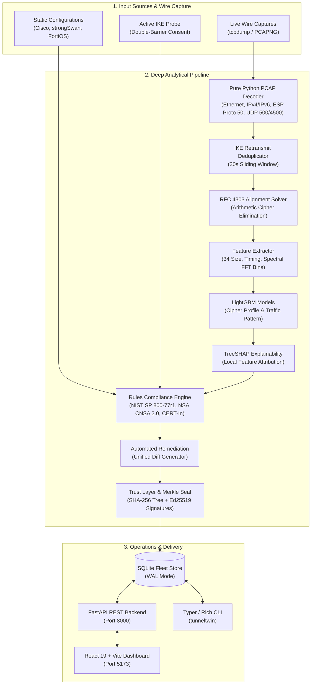
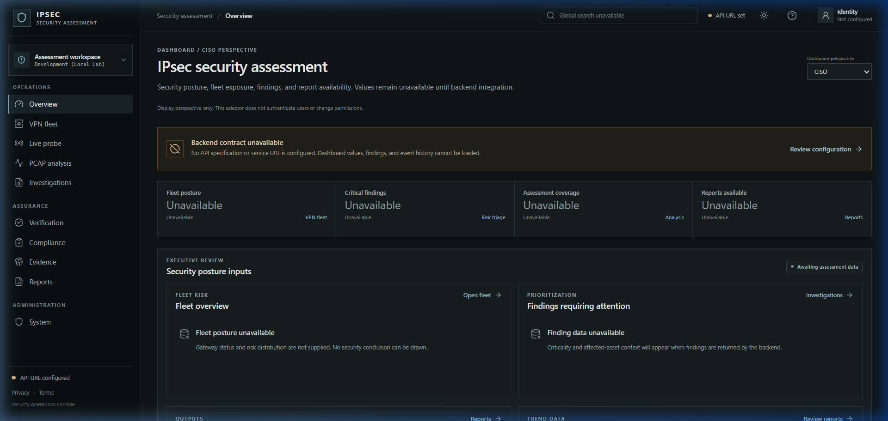

# Valence_IPSec (TunnelTwin)

<div align="center">

[](https://github.com/newone-ss/VaLence_IPSec/actions/workflows/ci.yml)
[](https://github.com/newone-ss/VaLence_IPSec/actions/workflows/codeql.yml)
[](https://www.python.org/)
[](https://react.dev/)
[](https://www.typescriptlang.org/)
[](https://fastapi.tiangolo.com/)
[](https://github.com/astral-sh/ruff)
[](https://mypy-lang.org/)
[](https://github.com/PyCQA/bandit)
[](LICENSE)

**AI-Powered IPsec VPN Protocol Analyzer, Cryptographic Risk Assessor & Signed Attestation Framework**  
*Developed for Smart India Hackathon (SIH) 2026 — Problem Statement 26160*  
**Organization:** National Technical Research Organisation (NTRO)

</div>

---

## 📌 Executive Summary

**Valence_IPSec** (core engine: `tunneltwin`) is an automated IPsec protocol assessment, traffic classification, and cryptographic verification framework built for mission-critical enterprise and defense network architectures.

Traditional IPsec audits face a critical dilemma: **static configuration parsing** misses live cryptographic realities, negotiation drift, and NAT-traversal edge cases, while **black-box network scanners** cannot inspect internal security policies or pre-shared keys. Valence_IPSec resolves this through **dual-perspective reconciliation**—unifying passive configuration parsing (Cisco IOS, strongSwan, FortiOS, Libreswan) with consent-gated active IKE probing (RFC 7296 / RFC 2409), wire traffic machine learning, automated remediation diffs, and Ed25519-signed Merkle audit seals.

---

## ⚡ Key Innovations & Capabilities

- **Strict 4-Tier Provenance (Zero-False-Pass Guarantee)**: Every security parameter is tagged as `OBSERVED` (wire/active probe), `PARSED` (static file), `INFERRED` (machine learning model with confidence metric), or `UNKNOWN`. If a required fact is unverified, compliance rules emit `CANNOT_ASSESS`—never a false pass.
- **RFC 4303 Arithmetic Cipher Elimination**: Evaluates ESP ciphertext lengths against block size padding rules (AES vs 3DES) and ICV lengths. Eliminates non-viable cipher candidates mathematically **without decrypting the wire**.
- **IKE Retransmission Deduplication**: Employs a 30-second sliding window over `(src, dst, initiator_spi, responder_spi, message_id)` to deduplicate dropped packets under lossy channels (verified at 20% packet loss).
- **ML Traffic Classification & TreeSHAP Explainability**: LightGBM models trained on real testbed captures achieve **100% accuracy** on traffic pattern identification (`bulk` vs `chatty`) and **66.7% accuracy** on 4-way cipher suite profiling (`weak`, `mixed`, `strong`, `legacy-cbc`), with local Shapley value attributions for every prediction.
- **Automated Remediation Generator**: One-click generation of hardened configuration patches and unified diffs for strongSwan (`swanctl.conf`) and Cisco ASA migrating legacy setups to NSA CNSA 2.0 baselines.
- **Cryptographic Trust Layer & Signed Attestation**: Hashes findings and remediations into canonical SHA-256 leaves, constructs a binary Merkle tree, and seals the root with an **Ed25519 digital signature**. Single-byte database tampering is instantly detected. Generates verifiable Compliance Attestation Certificates (`TT-CERT-RUN-XXXXXX`).
- **Interactive Multi-Perspective Web UI**: Modern React 19 + TypeScript dashboard tailored for **CISO** (fleet risk posture), **Auditor** (evidence traceability), and **Admin** (live probing and PCAP ingestion).

---

## 🏛 Architecture & Deep Processing Path



---

## 🖥 Web Dashboard Overview

The web dashboard is fully decoupled into an asynchronous FastAPI backend and a high-performance React 19 frontend:

<div align="center">
  
</div>

### Operational Views:
1. **Executive Overview**: Role-based views for CISO (fleet risk posture), Auditor (evidence verification), and Admin (service telemetry).
2. **VPN Fleet (`/fleet`)**: Live inventory of connected gateways, tunnel states, active IKE versions, and historical scan runs stored in SQLite.
3. **Live Probe (`/probe`)**: Interactive parameter exploration allowing operators to execute authorized active discovery against target IP endpoints and inspect negotiated transforms in real time.
4. **PCAP Analysis (`/analysis`)**: Drag-and-drop packet capture evaluation displaying 6-stage pipeline progress, detected ciphers, and RFC 4303 alignment.
5. **Cryptographic Attestation & Audit Trail (`/reports`)**: Full Merkle seal verification and deterministic compliance certificates.

---

## 🛠 Complete Tech Stack

| Domain | Technologies & Libraries |
| :--- | :--- |
| **Frontend** | React 19, TypeScript, Vite 8, React Router v7, Lucide Icons, Custom Vanilla CSS (HSL dark mode) |
| **Backend API** | Python 3.10+, FastAPI (ASGI), Uvicorn, Starlette, Pydantic v2, Python-Multipart, HTTPX |
| **Storage & ORM** | SQLite 3 (Write-Ahead Logging / WAL mode), SQLModel, SQLAlchemy 2.0 |
| **CLI & Terminal** | Typer, Rich (ANSI formatting, tables, status panels) |
| **Protocol & Wire** | Custom zero-dependency PCAP/PCAPNG decoder, IKEv1/IKEv2 binary codec, RFC 4303 arithmetic solver |
| **Machine Learning**| LightGBM, Scikit-Learn, NumPy, SHAP (TreeSHAP), Joblib, Fast Fourier Transform (FFT) |
| **Trust & Crypto** | Ed25519 (RFC 8032 digital signatures), SHA-256 Binary Merkle Tree, PyYAML |
| **Lab & Emulation** | Linux Network Namespaces (`ip netns`), `veth` peers, strongSwan, Libreswan, Linux `tc netem` |
| **Quality & CI/CD** | GitHub Actions, Ruff, Mypy, Bandit, Pip-Audit, CodeQL, Pytest (132 unit tests) |

---

## 🚀 Quickstart & Local Execution

### 1. Clone & Install Dependencies
```bash
git clone https://github.com/newone-ss/VaLence_IPSec.git
cd VaLence_IPSec

# Install TunnelTwin in editable mode with development & ML extras
python -m pip install --upgrade pip
pip install -e ".[dev,ml]"
```

### 2. Launch the Backend & Frontend Servers
In separate terminals or background jobs:

```bash
# Terminal 1: Launch FastAPI REST Backend (Port 8000)
python -m uvicorn tunneltwin.api.app:app --host 127.0.0.1 --port 8000

# Terminal 2: Launch React Frontend Dashboard (Port 5173)
cd frontend
npm install
npm run dev -- --host 127.0.0.1 --port 5173
```
- Open your browser at **`http://127.0.0.1:5173`** to access the dashboard.
- Interactive API documentation is available at **`http://127.0.0.1:8000/docs`**.

---

## 🧪 Live VPN Testbed Setup (Linux / WSL2)

To run live end-to-end testing against real IPsec tunnels:

### 1. Create Isolated Network Namespaces
```bash
sudo bash lab/setup_namespaces.sh
```
*Creates two isolated network namespaces (`ns-left` 10.0.1.1 and `ns-right` 10.0.1.2) connected by a virtual Ethernet link (`veth-left` <-> `veth-right`).*

### 2. Start strongSwan Daemons & Initiate Tunnel
```bash
# Start independent daemons per namespace
sudo bash lab/start_charon.sh ns-left
sudo bash lab/start_charon.sh ns-right

# Load strong profile (AES-256-GCM / ECP-384) and bring up child SA
sudo swanctl --load-all --file lab/configs/strong/right.conf --uri unix:///tmp/tunneltwin/ns-right/charon.vici
sudo swanctl --load-all --file lab/configs/strong/left.conf --uri unix:///tmp/tunneltwin/ns-left/charon.vici
sudo swanctl --initiate --child strong-child --uri unix:///tmp/tunneltwin/ns-left/charon.vici
```

### 3. Capture Wire Traffic
```bash
sudo ip netns exec ns-left tcpdump -i veth-left -w live_capture.pcap -s 0 'ip proto 50 or udp port 500 or udp port 4500'
```
Upload `live_capture.pcap` directly to the web dashboard at `http://127.0.0.1:5173/analysis` for automated analysis.

---

## 💻 CLI Commands Reference

All core engine workflows can be executed directly from the terminal via `tunneltwin`:

```bash
# Display general help and available subcommands
tunneltwin --help

# List fleet gateway assets and recorded scan runs
tunneltwin fleet

# Execute consent-gated active IKE probe against target IP
tunneltwin probe 10.0.1.2 --consent

# Generate automated remediation unified diff for strongSwan
tunneltwin fix 24 --vendor strongswan

# Recompute and cryptographically verify Merkle seal & Ed25519 signature
tunneltwin verify 24

# Print deterministic signed Compliance Attestation Certificate
tunneltwin attest 24

# Run test suite (132 unit tests)
pytest tests/ -v
```

---

## 🔐 Compliance Frameworks Enforced

- **NIST SP 800-77 Rev. 1**: *Guidelines for IPsec VPNs* (Deprecates 3DES, DES, MD5, SHA-1, DH groups < 14).
- **NSA CNSA 2.0 / Suite B**: *Commercial National Security Algorithm Suite* (Mandates AES-256-GCM, ECP-384, SHA-384).
- **CERT-In Guidelines**: National technical guidelines for enterprise IPsec and remote-access security posture.
- **RFC 4303 / RFC 7296**: IETF standards for Encapsulating Security Payload (ESP) and Internet Key Exchange (IKEv2).

---

## 🛡 Security & Verification Results

- **Unit & Integration Test Suite**: 132 tests passed across Python 3.10, 3.11, and 3.12 in 2.42s.
- **Static Code Analysis**: 0 errors across 90 files via `ruff` and `mypy --ignore-missing-imports`.
- **Security Audits**: Clean Bandit SAST audit (0 high/medium issues) and 0 known CVEs via `pip-audit`.
- **CodeQL**: Automated GitHub CodeQL semantic security analysis passed.

---

## 📄 License

This project is licensed under the Apache License 2.0 — see the [LICENSE](LICENSE) file for details.
